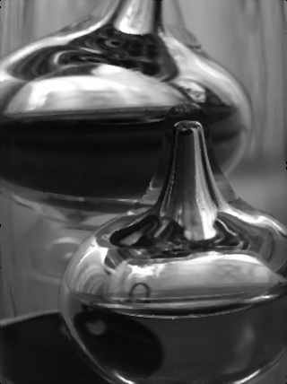

<h1>Результаты работы программы по устранению эффекта "соль и перец" с изображения</h1>

<h2>Таблица с полученными значениями времени выполнения и результаты обработки</h2>

Исходное изображение с википедии:

| matrix size   | parameters                                             |    gpu time |   scipy time |   func time | gpu result               | scipy result               | func result               |
|:--------------|:-------------------------------------------------------|------------:|-------------:|------------:|:-------------------------|:---------------------------|:--------------------------|
| (428, 320)    | {'blockX': 32, 'blockY': 32, 'gridX': 11, 'gridY': 14} | 5.67001e-05 |    0.0090728 |      195.43 |  |  |  |

<h2>Таблица с полученными ускорениями</h2>

|   gpu vs func |   gpu vs scipy |
|--------------:|---------------:|
|   3.44673e+06 |         160.01 |